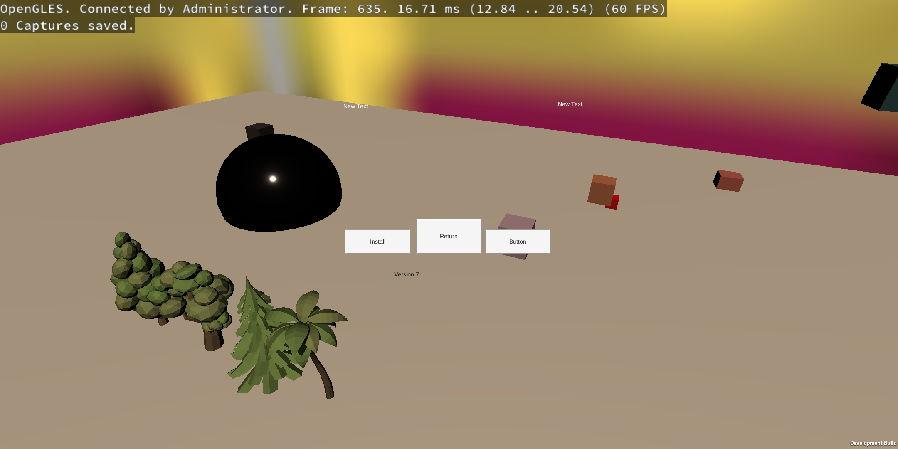

# 介绍

Renderdoc 是一个逐帧的图形调试器，适用于Vulkan，D3D11，D3D12，OpenGL和OpenGL ES多种图形API，适用于构建于Windows，Linux，Android，Stadia，和Nintendo Switch多种的平台的应用。

## License

Renderdoc 基于 MIT 开源协议。所以Renderdoc对你的商用和非商用都没有任何限制。你可以在这里下载到它的源码：[https://github.com/baldurk/renderdoc](https://github.com/baldurk/renderdoc)

# 使用

Renderdoc的工作流很简单。

1. 它在启动应用的时候加载调试器
2. 然后在你需要捕获帧的时候将当前绘制帧的所有信息都保存到一个文件中
3. 你可以打开这个文件，但前提是你的应用需要运行中，因为它需要你的机器的硬件和你的应用的一些资源信息去解析这个文件
4. 解析好之后你就可以在它内置的各种视图里调试了

在此之前，你需要准备一个允许加载调试器的包。在Unity应用上体现为打包的时候，将Development Build勾选上。

## 快速开始

### 捕获帧

打开Renderdoc，点开 *Launch Application* 视图。

1. 在这里检查你是否连上了机器。Renderdoc会在手机上安装两个服务。如果这里显示大红×，说明连接出现了异常。
2. 在这里选择需要调试的应用的主活动。
3. 在这里启动你的应用。通过Renderdoc启动应用，Renderdoc会为待调试应用加载调试器。如果调试器成功附着到应用上，则应用的左上角应该显示一行白色的字，显示当前的一些信息。

等应用启动完毕，就可以在Renderdoc的 [捕获](#buhuo) 视图捕获帧了。

### 调试帧

Renderdoc提供了很多视图为你调试提供便利。一些主要的视图包括：

**Texture Viewer** 纹理视图。在这个视图中你可以查看在绘制当前的帧的时每一步Drawcall在做的事情。从这个视图中，你可以知道GPU可能在：绘制网格，制作Mipmap，制作阴影贴图，渲染光照，应用后处理等等。你可以通过这个视图去查看当前帧所运用的纹理贴图或者RenderTexture，可以查看当前GPU在缓冲中的输出或者输入的纹理。更多信息请参考章节 [Texture View](#TextureView)

下图显示此刻GPU在绘制两个树形网格。

**Event Browser** 事件浏览器。在这个视图中你可以查看当前帧所包含的一些重要的渲染函数。其中DrawCall函数都处在叶节点的位置。你可以细数当前帧每个Drawcall所处的位置，并细数每个Drawcall提交的图元数量。更多信息请参考章节 [Event Browser](#EventBrowser)

**API Inspector** API 视图。每当一个Drawcall在 [Event Browser](#EventBrowser) 中被选中，API 视图都会在此更新有关当前Drawcall的信息。这些信息包括从上次Drawcall到当前Drawcall所经历的一些函数（因为OpenGL的渲染机制是基于状态机的，所以在OpenGL中这些往往都是一些改变渲染状态的函数，包括纹理状态，顶点状态，颜色状态，等等）。更多信息请参考 [API Inspector](#APIInspector) 

**Timeline Bar** 时间线视图。这个视图可是看作是 [Event Browser](#EventBrowser) 的另一个版本。它将 [Event Browser](#EventBrowser) 中的函数按照时间线进行排列，你可以在这个视图上清晰看到每个函数在当前帧中所占用的相对时间，以及每个Drawcall在时间线上所处的位置。更多信息请参考 [Timeline Bar](#TimelineBar)

**Pipeline State** 渲染管线状态视图。你可以在这个视图中看到对应Drawcall的渲染管线的状态，包括启用了哪个着色器，每个着色器的输入输出，等等。你甚至可以查看着色器对应的GLSL源码。更多信息请参考 [Pipeline State](#PipelineState)

**Mesh Viewer** 网格视图。你可以在这个视图查看当前Drawcall提交的顶点信息，即当前Drawcall在顶点着色器中的输入。你还可以查看顶点着色器的输出，等等。更多信息请参考 [Mesh Viewer](#MeshViewer)

**其他视图** 上面主要列举一些调试用的最经常使用到的视图。一些高级视图可以查看章节 [高级](#gaoji)

