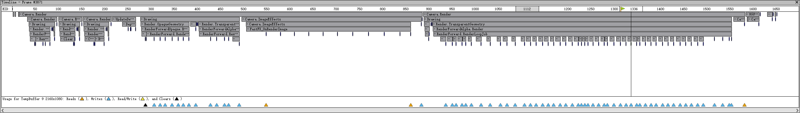

# 一，介绍

Renderdoc 是一个逐帧的图形调试器，适用于Vulkan，D3D11，D3D12，OpenGL和OpenGL ES多种图形API，适用于构建于Windows，Linux，Android，Stadia，和Nintendo Switch多种的平台的应用。


## 1-1：License

Renderdoc 基于 MIT 开源协议。所以Renderdoc对你的商用和非商用都没有任何限制。你可以在这里下载到它的源码：[https://github.com/baldurk/renderdoc](https://github.com/baldurk/renderdoc)


<div STYLE="page-break-after: always;"></div>

# 二，使用

Renderdoc的工作流很简单。

1. 它在启动应用的时候加载调试器
2. 然后在你需要捕获帧的时候将当前绘制帧的所有信息都保存到一个文件中
3. 你可以打开这个文件，但前提是你的应用需要运行中，因为它需要你的机器的硬件和你的应用的一些资源信息去解析这个文件
4. 解析好之后你就可以在它内置的各种视图里调试了

在此之前，你需要准备一个允许加载调试器的包。在Unity应用上体现为打包的时候，将Development Build勾选上。


## 2-1：捕获帧

打开Renderdoc，点开 *Launch Application* 视图。


1. 在这里检查你是否连上了机器。Renderdoc会在手机上安装两个服务。如果这里显示大红×，说明连接出现了异常。
2. 在这里选择需要调试的应用的主活动。
3. 在这里启动你的应用。通过Renderdoc启动应用，Renderdoc会为待调试应用加载调试器。如果调试器成功附着到应用上，则应用的左上角应该显示一行白色的字，显示当前的一些信息。


等应用启动完毕，Renderdoc会跳到一个用于捕获帧的视图：


如上图所示，视图有四个部分组成，分别在图中用红色的数字标出：

**1. Status** 状态。在这里你可以看到以下信息：

- Target：调试的目标。由机器名称，调试的应用包名及其进程pid组成。
- Connection Status：Renderdoc与机器的连接状态。
- API：应用所使用的图形API。

**2. Tools** 工具。在这里设置如何捕获：

- Capture Frame(s) Immediately ：立即开始捕获。捕获多少帧在它上面的文本框中设置。
- Capture After Delay：n 秒之后开始捕获。捕获多少帧也是在最上面的文本框中设置。
- Capture Specific Frame(s)：捕获特定序号的帧。Renderdoc从启动应用开始，就为每一帧编了序号。当当前帧的序号等于你设置的捕获序号时，Renderdoc就会将该帧捕获下来。它其实发送了一个信号，这个信号通知Renderdoc的服务端等待特定序号的帧出现。由于帧的序号是递增的，所以如果设置的序号的帧已经渲染过了，那这个帧永远不会被捕获。

**3. Captures collected** 显示捕获的帧。每个帧都包含自身的序号，大小和被捕获时的物理时间。

**4** 底部的功能栏。功能有：

- Preview：在Captures Collected窗口选择一个帧，点击Preview会展开一个预览窗口。
- Open：打开当前选中的帧。
- Save：保存帧。
- Delete：删除帧。


## 2-2：调试帧

Renderdoc提供了很多视图为你调试提供便利。一些主要的视图包括：


**Texture Viewer** 纹理视图。在这个视图中你可以查看在绘制当前的帧的时每一步Drawcall在做的事情。从这个视图中，你可以知道GPU可能在：绘制网格，制作Mipmap，制作阴影贴图，渲染光照，应用后处理等等。你可以通过这个视图去查看当前帧所运用的纹理贴图或者RenderTexture，可以查看当前GPU在缓冲中的输出或者输入的纹理。更多信息请参考章节 [Texture Viewer](#TextureViewer)

下图显示此刻GPU在绘制两个树形网格。


**Event Browser** 事件浏览器。在这个视图中你可以查看当前帧所包含的一些重要的渲染函数。其中DrawCall函数都处在叶节点的位置。你可以细数当前帧每个Drawcall所处的位置，并细数每个Drawcall提交的图元数量。更多信息请参考章节 [Event Browser](#EventBrowser)


**API Inspector** API 视图。每当一个Drawcall在 [Event Browser](#EventBrowser) 中被选中，API 视图都会在此更新有关当前Drawcall的信息。这些信息包括从上次Drawcall到当前Drawcall所经历的一些函数（因为OpenGL的渲染机制是基于状态机的，所以在OpenGL中这些往往都是一些改变渲染状态的函数，包括纹理状态，顶点状态，颜色状态，等等）。更多信息请参考 [API Inspector](#APIInspector) 


**Timeline** 时间线视图。这个视图可是看作是 [Event Browser](#EventBrowser) 的另一个版本。它将 [Event Browser](#EventBrowser) 中的函数按照时间线进行排列，你可以在这个视图上清晰看到每个函数在当前帧中所占用的相对时间，以及每个Drawcall在时间线上所处的位置。更多信息请参考 [Timeline](#Timeline)


**Pipeline State** 渲染管线状态视图。你可以在这个视图中看到对应Drawcall的渲染管线的状态，包括启用了哪个着色器，每个着色器的输入输出，等等。你甚至可以查看着色器对应的GLSL源码。更多信息请参考 [Pipeline State](#PipelineState)


**Mesh Viewer** 网格视图。你可以在这个视图查看当前Drawcall提交的顶点信息，即当前Drawcall在顶点着色器中的输入。你还可以查看顶点着色器的输出，等等。更多信息请参考 [Mesh Viewer](#MeshViewer)


**其他视图** 上面主要列举一些调试用的最经常使用到的视图。一些高级视图可以查看章节 [视图](#shitu)


<div STYLE="page-break-after: always;"></div>

# <span id="shitu">三，视图</span>

Renderdoc的每个视图都是一个功能的合集，它可能专门用来查看纹理，或者专门查看渲染管线，或者专门查看当前顶点着色器的输入的网格......如果你发现有某个视图没有显示出来，可以菜单栏中的`window`里打开它。

下面我们对每个视图进行详细的介绍：


## <span id="TextureViewer">3-1：Texture Viewer</span>


Texture View（纹理视图）主要是查看当前Drawcall中所使用的纹理（或者生成的纹理）。主要以下几个部分组成：

- 工具栏
- 纹理列表（需手动打开）
- 主预览窗口
- 预览缩略图
- 当前选中的像素内容
- 状态栏


### 工具栏

工具栏是该视图中最丰富最复杂的部分。下面分别介绍其包含的功能：


下面这部分用于改变纹理在主视图中的显示形式，例如切换显示的颜色通道，切换无纹理区域的背景色（纯色填充或者黑白格子填充）。


下面这部分选择显示纹理的一些附加资源，比如其Mipmap，或者3D纹理的切片（Slice）。


下面这部分可以对当前纹理完成一些动作。从左到右分别是：

- 保存当前纹理
- 显示当前帧所用到的<span id="OpenTextureList">**纹理列表**</span>
- 打开一个新视图显示当前纹理的数据
- 通过输入坐标，显示对应坐标的像素信息
- 在Resource视图中的显示当前纹理的信息
- 未知？


下面这部分用于对主预览窗口的纹理进行放大缩小。Fit表示根据窗口大小自适应。上下箭头表示将纹理上下翻转。


下面这部分是重点。它表示对当前预览的纹理追加的显示效果，这个效果一般只对Outputs中FBO部分的纹理起作用，因为Drawcall绘制的内容都会先放在这个FrameBuffer里面。它对你分析当前帧的输入输出纹理变化非常有帮助。主要有以下几个选项：

- None：没有任何效果
- Highlight Drawcall：高亮当前Drawcall所绘制的内容
- Wireframe Mesh：将当前Drawcall所绘制的内容以网格形式显示
- Depth Test：高亮参与深度测试的部分
- Stencil Test：高亮参与模板测试的部分
- Backface Cull：高亮背面剔除的部分
- Viewport/Scissor：显示视口区域
- NaN/Inf-ve display：以灰度图的方式显示当前纹理
- Clipping：以绿色高亮当前纹理像素值高于Range的白色游标部分，以红色高亮当前纹理像素值低于Range的黑色游标部分。关于Range部分请往下阅读。
- Clear before Pass：显示执行当前Pass之前Clear（颜色，深度，或者模板）之后的结果。
- Clear before Draw：显示执行当前Drawcall之前的Clear之后的结果。
- Quad Overdraw（Pass）：？
- Quad Overdraw（Draw）：？
- Triangle Size（Pass）：？
- Triangle Size（Draw）：？


下面这部分用黑色游标和白色游标划定三个区域。在当前纹理中任意一个像素值必定处于这三个区域中的一个。处于不同区域的像素会有不同的表现，具体如何表现还跟Overlay有关。例如在None模式下，低于黑色游标的像素会变黑色，高于白色游标的区域的像素会变白色。当黑色游标和白色游标重合时，纹理会显示为一张纯黑和纯白的图。你还可以点击最后一个按钮，显示当前纹理中像素值的分布柱状图。


### 纹理列表

在工具栏的[这一项](#OpenTextureList)打开纹理列表。这里列出当前帧所用到的所有纹理，包括预输入的和动态生成（Shadow Map等）的。


### 主预览窗口

当你在纹理列表选中一个纹理时，主预览窗口会显示你当前选中的纹理。当你点击预览缩略图中的其中一项时，主预览窗口会显示当前选中的缩略图中的内容。在主预览窗口中移动鼠标，状态栏会更新更新当前鼠标所在位置的像素的信息。当你右键点击时，像素窗口会显示当前像素及其附近部分像素的特写。


### 当前选中的像素内容

见**主预览窗口**。


### 状态栏

状态栏显示以下内容：

- 当前纹理的名称
- 纹理大小
- mipmap数量
- 图像格式
- 当前选中像素的坐标和RGBA信息


## <span id="EventBrowser">3-2：Event Browser</span>

事件浏览器是最重要的一个视图之一：它会显示当前一系列的API调用，具体显示什么取决于用户代码中的注解。例如在OpenGL中，被`glPushDebugGroupKHR`包围起来的API就会被Renderdoc捕获并显示在EventBrowser中。Renderdoc会展开最上层的API，直到展开到图形API层面，于是会看到一定的调用层级。

```c
// omitted code to initialise the extension
glPushDebugGroupKHR(GL_DEBUG_SOURCE_APPLICATION, 0, -1, "Begin Section");
// contents of section here
glPopDebugGroupKHR();
```


**列** 默认的列只有 EID 和 Name两项。我们可以在任意一个列名上面右键 -> Select Columns，然后把所有的选上。会多出 Draw # 和 Duration (μs) 两列。

- EID：注解中每一个API被调用，都会使EID加一。注意，不是所有的API都会显示出来，所以你会看到EID并不是连续的。其中，Drawcall类型的API可以通过[API Inspector](#APIInspector)显示其隐藏的API。
- Name：API的名字。如果Drawcall类型的API，后面还会跟一些重要的参数在一对圆括号里面。比如`glDrawElements`会显示其绘制的图元数量，`glClear`会显示其清除属性和清除值。
- Draw #：表示到当前API调用位置，已经发生了多少了Drawcall类型的API调用。
- Duration（μs）：API调用耗时。你需要点击Event Browser中的工具栏里的时钟图标，这一列才会显示出值。


**工具栏** 主要有以下这些图标：


- 左箭头/右箭头：跳转到上一个Drawcall调用/跳转到下一个Drawcall调用。
- 望远镜：弹出一个文本框，在里面输入字符串，通过字符串查找API。
- 旗帜：弹出一个文本框，输入EID，跳转到对应的API。
- 时钟：显示Duration（μs）列，并列出API的耗时。
- 四杠：选择显示哪些列。
- 六角星：为当前选中的API添加书签标记。
- 软盘：保存当前帧的Event Browser为文本。
- 拼图：？


## <span id="APIInspector">3-3：API Inspector</span>

API Inspector视图只有你在 [Event Browser](#EventBrowser) 中选中一个Drawcall调用的时候，这个视图才会出现东西。它分成两部分：上半部分显示的从上一个Drawcall到当前Drawcall的图形API调用。下半部分会显示当前Drawcall的调用堆栈，会一直追溯到用户代码。一般情况下，下半部分不会出现东西，因为需要一些特殊的设置，并且加载和解析符号表，过程十分耗时。


**上半部分** 上半部分有两部分组成：EID和Event，分别代表API的调用序号和API名称。这一列API的最后一个一定是一个Drawcall类型的API，并且与你当前在[Event Browser](#EventBrowser)中选中的API对应。而上面的API序列表示自从上次发生Drawcall到当前Drawcall调用时所发生的图形API的调用。例如，如果是Opengl的平台，那显示的都是Opengl的函数；如果是Vulkan，那显示的就是Vulkan的函数，类似于这样：


点击API序号左侧的右向箭头可以展开显示当前API的参数：


**下半部分** 略（很遗憾没有成功加载符号表）


## <span id="Timeline">3-4：Timeline</span>

Timeline是[Event Browser](#EventBrowser)的另一种形式，它以火焰图的形式呈现API的调用堆栈。在火焰图的最顶端，即图中每一个蓝色节点都对应[Event Browser](#EventBrowser)中的一个Drawcall。但是这个Timeline上的“时间坐标”是指API的EID，对应的API的调用次序，并不能反应每个API消耗的物理时间。



Timeline最重要的一个功能是查看纹理的读写发生的位置。通过在Texture View上的Texture List里选中其中一个纹理，在Timeline的底部会出现一些最多四种不同颜色的三角形。每种颜色三角形的含义写在了左上角：分别表示读，写，读/写，清除四种纹理操作。每个三角形所处的位置表示当前选中的纹理在当前三角形的位置上发生了对应的纹理操作。


## <span id="PipelineState">3-5：Pipeline State</span>

Pipeline State 视图，即渲染管线状态视图呈现当前Drawcall对应的渲染管线，是一个包含信息非常多的视图。它主要由两部分组成，一部分最上面的管线流程图，剩下的就是另一部分，这部分在你选中管线流程图中的任意一个阶段时都会相应地更新出信息。

